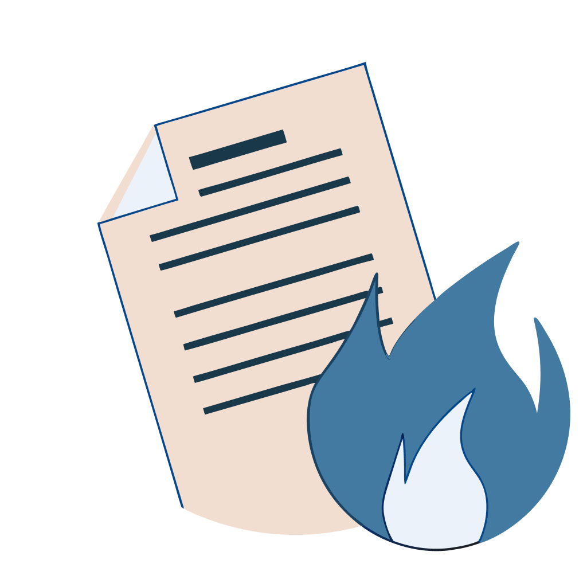

# BurnNote



## Overview
BurnNote is a simple yet secure, self-hosted note-taking web application designed to protect sensitive information. Users can create notes that expire after a single read or reach a set expiration date, ensuring maximum privacy and data security.

## Features
- ✅ **Ephemeral Notes**: Notes are automatically deleted after being read.  
- ⏳ **Expiration Control**: Define how long a note remains accessible.  
- 🔒 **Encryption**: Utilizes AES-GCM encryption to safeguard note content.  
- 🌐 **RESTful API**: Allows programmatic access to create, retrieve, and manage notes.  
- ⚙️ **Easy to Deploy**: Developed with Python, Flask, and SQLAlchemy for quick setup.  
- 📦 **Marshmallow Integration**: Ensures reliable data serialization and validation.  

## Tech Stack
- 🐍 **Python 3**  
- 🌶️ **Flask** (Web framework)  
- 🗄️ **SQLAlchemy** (ORM for database interactions)  
- 🧩 **Marshmallow** (Validation and serialization)  
- 🔐 **AES-GCM** via cryptography library (Encryption)  

## Project Structure
- 📂 **/burnote/models**: Contains database models and encryption logic.  
- 📂 **/burnote/api**: Houses the RESTful API definitions and schema validations.  
- 📂 **/burnote/templates**: Template files for the web interface.  
- 📂 **/burnote/static**: Static resources (CSS, JS, etc.).  
- 📂 **/burnote**: Main Flask app logic and configuration.  

## Installation & Setup
1. Clone the repository:  
   ```sh
   git clone https://github.com/Andriyshkoy/BurNote.git  
   ```
2. Create and activate a virtual environment:  
   ```sh
   python -m venv venv  
   source venv/bin/activate  
   ```
3. Install dependencies:  
   ```sh
   pip install -r requirements.txt  
   ```
4. Configure environment variables as needed (e.g., secret keys, database URI).  
5. Initialize the database:  
   ```sh
   flask db upgrade  
   ```
6. Run the application:  
   ```sh
   flask run  
   ```

## Usage
1. 📝 **Create a new note** by providing text and optional settings (expiration, burn-after-reading).  
2. 🔗 **Securely share the generated key** with the intended recipient.  
3. ⏲️ **The note expires** upon the first read or once the expiration date is reached.  

## Contributing
Pull requests, bug reports, and feature suggestions are welcome. Open an issue or submit a PR to help improve BurnNote.  

## License
This project is licensed under the MIT License. See the LICENSE file for details.
