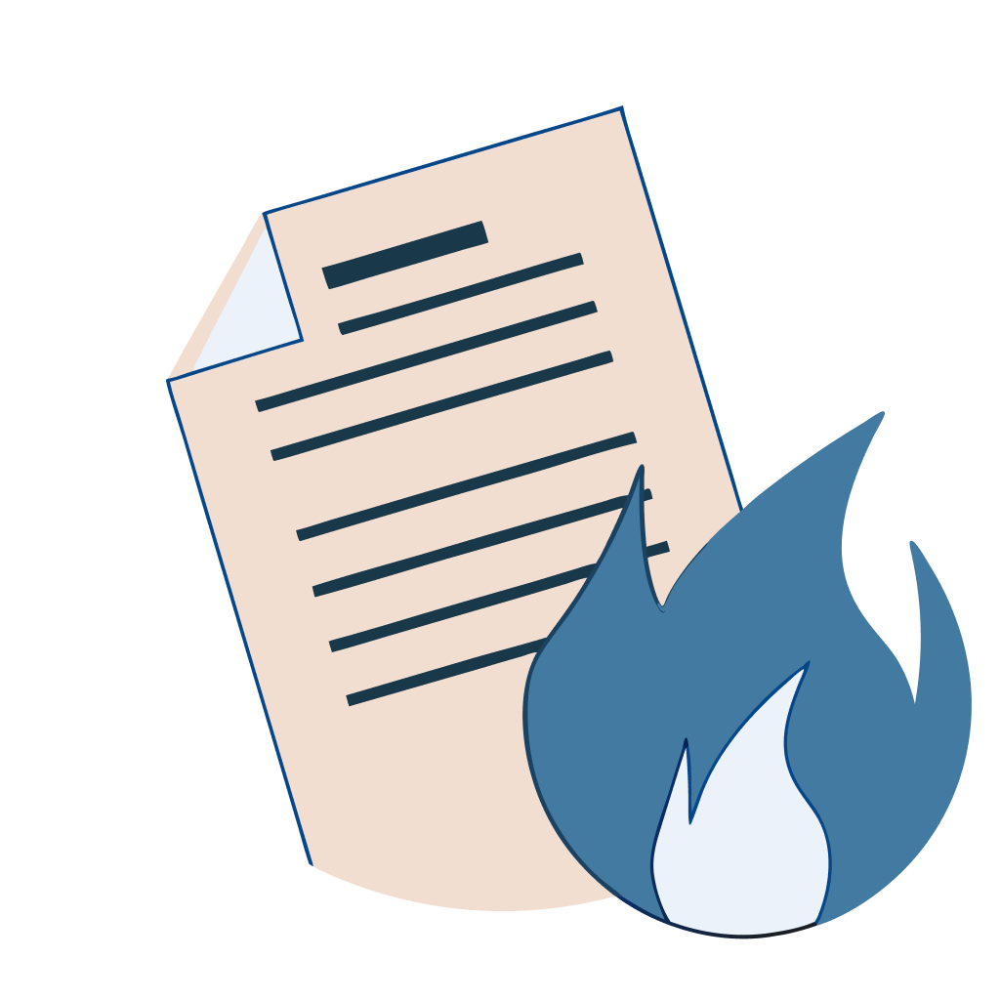

# BurnNote



## Overview

BurnNote is a simple yet secure, self-hosted note-taking web application designed to protect sensitive information. Users can create notes that expire after a single read or reach a set expiration date, ensuring maximum privacy and data security.

You can try the service at [burnote.andriyshkoy.ru](http://burnote.andriyshkoy.ru) where it is hosted.

## Features

- ✅ **Ephemeral Notes**: Notes are automatically deleted after being read.  
- ⏳ **Expiration Control**: Define how long a note remains accessible.  
- 🔒 **Encryption**: Utilizes AES-GCM encryption to safeguard note content.  
- 🌐 **RESTful API**: Allows programmatic access to create, retrieve, and manage notes.  
- ⚙️ **Easy to Deploy**: Developed with Python, Flask, and SQLAlchemy for quick setup.  
- 📦 **Marshmallow Integration**: Ensures reliable data serialization and validation.  
- 🐳 **Docker Support**: Easily deployable using Docker containers.  
- 🗄️ **PostgreSQL**: Uses PostgreSQL as the database in production for robust data management.  

## Tech Stack

- 🐍 **Python 3**  
- 🌶️ **Flask** (Web framework)  
- 🗄️ **SQLAlchemy** (ORM for database interactions)  
- 🧩 **Marshmallow** (Validation and serialization)  
- 🔐 **AES-GCM** via cryptography library (Encryption)  
- 🐳 **Docker** (Containerization)  
- 🗄️ **PostgreSQL** (Production database)  

## Project Structure

- 📂 **backend/burnote**: Main Flask app logic and configuration.  
- 📂 **backend/burnote/models**: Contains database models and encryption logic.  
- 📂 **backend/burnote/api**: Houses the RESTful API definitions and schema validations.  
- 📂 **backend/burnote/webapp**: Logic for the web application's views, handling user interactions and rendering templates.
- 📂 **backend/burnote/templates**: Template files for the web interface.  
- 📂 **backend/burnote/static**: Static resources (CSS, JS, etc.).

## Installation & Setup

### Local Development

1. Clone the repository:

   ```sh
   git clone https://github.com/Andriyshkoy/BurNote.git  
   ```

2. Create and activate a virtual environment:

   ```sh
   python -m venv venv  
   source venv/bin/activate  
   ```

3. Install dependencies:

   ```sh
   pip install -r requirements.txt  
   ```

4. Configure environment variables as needed (e.g., secret keys, database URI).  
5. Initialize the database:

   ```sh
   flask db upgrade  
   ```

6. Run the application:

   ```sh
   flask run  
   ```

### Using Docker

1. Clone the repository:

   ```sh
   git clone https://github.com/Andriyshkoy/BurNote.git  
   ```

2. Navigate to the project directory:

   ```sh
   cd BurNote  
   ```

3. Build the Docker image:

   ```sh
   docker build -t burnote backend/.
   ```

4. Run the Docker container:

   ```sh
   docker run -d -p 5000:5000 --name burnote burnote  
   ```

The application will be accessible at `http://localhost:5000`.

## Usage

1. 📝 **Create a new note** by providing text and optional settings (expiration, burn-after-reading).  
2. 🔗 **Securely share the generated key** with the intended recipient.  
3. ⏲️ **The note expires** upon the first read (if burn-after-read parameter set to True) or once the expiration date is reached.  

## API Usage

BurnNote provides a RESTful API for programmatic access to its features.
Refer to the OpenAPI specification located in [openapi.yml](backend/burnote/static/openapi.yml) for detailed information on available endpoints and their usage.

## CI/CD

This project includes GitHub Actions workflows for Continuous Integration (CI) and Continuous Deployment (CD).

- **CI Workflow**: The [ci.yml](.github/workflows/ci.yml) workflow is triggered on pushes to the `dev` branch. It builds and pushes Docker images for the backend and nginx services to Docker Hub.
- **CD Workflow**: The [deploy.yml](.github/workflows/deploy.yml) workflow is triggered on pushes to the `main` branch. It deploys the application to the server by copying the necessary files via SSH and executing remote commands to pull the latest Docker images and restart the services.

## Contributing

Pull requests, bug reports, and feature suggestions are welcome. Open an issue or submit a PR to help improve BurnNote.  

## License

This project is licensed under the MIT License. See the LICENSE file for details.
